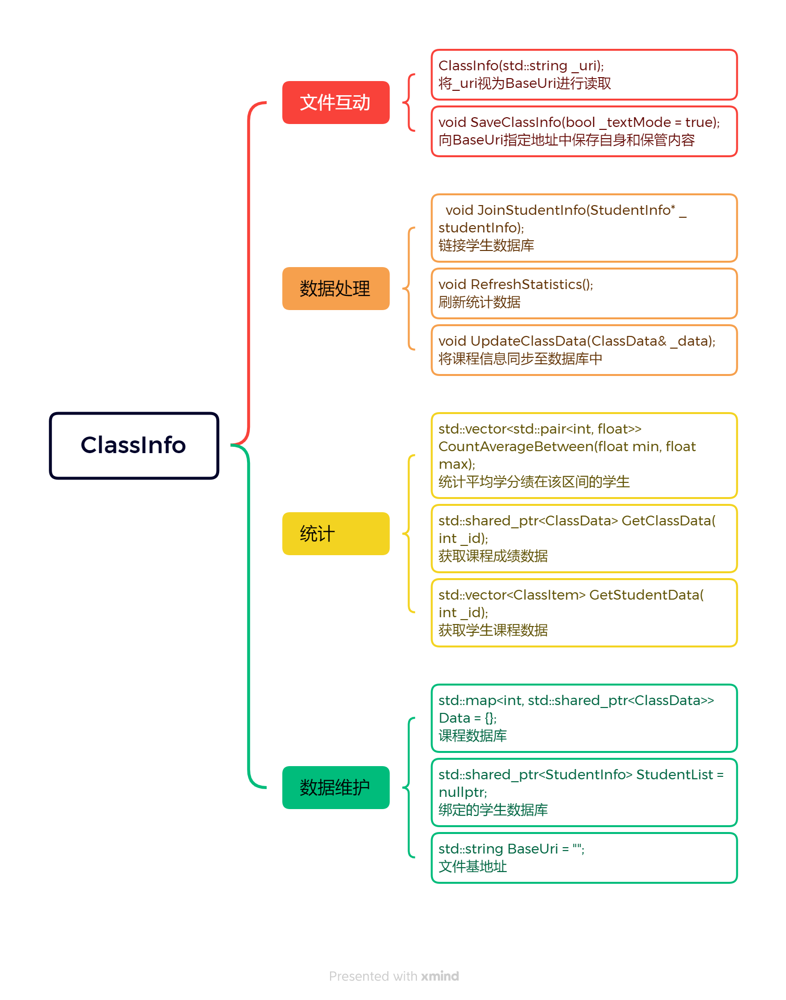

# 学生成绩管理系统设计书

[Github传送门](https://github.com/DreamEnderKing/Homework202307)

## 目录

1.[系统需求分析](#系统需求分析)

2.[总体设计](#总体设计)

3.[详细设计](#详细设计)

4.[系统调试](#系统调试)

5.[结果分析](#结果分析)

6.[总结](#总结)

## 系统需求分析
----

成绩管理系统可以全面反映出学生参加考试的课程序号和相应的成绩，因此需要提供以下功能：

### 1.录入功能：
通常情况下录入数据以每门课程统一的成绩表形式呈现，成绩管理系统应当支持两种录入方式：

A．文件录入：直接获取数据文件路径，按照约定格式进行读取
B．流输入：先读取课程名称，然后从cin流中逐项读取数据

### 2.修改功能：
支持修改学生成绩

### 3.查询功能：
支持查询学生完整成绩单或单项成绩，也支持查询单项课程完整成绩单和相关统计数据。统计数据应当支持两种输出方式：

A．成绩单输出：输出格式为“课程名称+成绩+若干统计数据”（个人端）/“学生id+成绩+若干统计数据”

B．数据表输出：输出格式为“课程/学生id+成绩”

### 4.统计功能：
支持统计平均学分绩、单科成绩等指标在某区间内的学生id

## 总体设计
----

成绩管理系统包含4项功能：录入、修改、查询与统计。

### 录入
在录入时用户可以选择直接给出文件路径，该文件第一行为”该课程ID 名称Name 学分Point”，剩下行为学生成绩数据，格式为“学生ID 成绩”。也可以先手动输入课程信息，然后输入学生成绩数据，当输入满足数据约定时将自动添加数据，否则输入负数ID或负数成绩时退出输入模式，将数据同步到内存中的数据库。

### 修改

修改时用户需要提供课程号ID和学生ID，首先判断课程是否存在，若不存在则驳回操作，保证课程添加只能通过录入步骤进行。然后判断学生ID是否存在，若存在则修改学生成绩，否则显示是否添加新的数据条目，如果确认添加，则新增学生成绩条目。上述步骤完成后将对内存中的数据库作出相应的改动。

### 查询

查询分支为2功能x2显示的组合，功能为：查询学生个人成绩/查询单门课程成绩，显示为：人性化排版+统计数据/数据表格式。
查询时用户根据需要提供学生/课程ID，确认数据存在后程序将输出对应数据。如果选择了人性化排版，那么程序还会额外统计相关信息，如个人成绩的平均学分绩、总学分和课程成绩的平均分、最高/低分及名单。

### 统计

统计用于统计学分绩在某个区间内学生的集合，可以选择整体学分/单项学分两种模式，选择后者时需要额外提供课程ID，在给出区间端点(-1代表无端点)后，程序将输出在该区间内学生的ID和成绩信息。

## 详细设计
----

程序将前后端进行分离。负责后端数据处理的有三个功能类(ClassInfo, StudentInfo和ClassData)和三个数据结构体(StudentBriefData, ModifyLog和ClassItem)，其声明均在Structure.h中(Structure命名空间下)。负责前端用户交互的为5个函数，对应封面和录入、修改、查询与统计四大功能，声明均在Displayer.h中(Displayer命名空间下)。两者通过main()中维护的唯一ClassInfo实例进行交互。

Structure各类和结构体层次图为：

### 功能类：

#### `ClassInfo`

和Displayer.h中用户展示方法交互的接口，图示如下： 	

#### `StudentInfo`

学生数据库，同时负责将修改后的ClassData及时合并到维护的学生平均学分绩等统计数据中。

#### `ClassData`

单门课程数据结构，包括课程相关信息和学生数据库，同时维护修改记录，便于省去无谓的全局比较过程。

### 数据结构体：

#### `StudentBriefData`

常用的单个学生统计数据，成员：平均成绩(`float averageScore`),总学分(`int totalPoint`)

#### `ModifyLog`

单项修改记录，成员：修改状态(`ModifyStatus status`),学生ID(`int stuID`),成绩(`int score`),之前成绩(`int oldScore`,仅在`status==Modified`时有效)。

#### `ClassItem`

单项成绩，成员：课程ID(`int ID`),课程名称(`string Name`),成绩(`int Point`),学分(`int ClassPoint`)

### 用户交互函数

在主函数`main()`中维持变量`branch`，在不同的界面，用户选择不同的操作后，用户交互函数会返回`int`值，主函数则将`int`值写入`branch`并根据其数值选择下一步要使用的用户交互函数。当用户交互函数出错时，主函数将错误消息返回到屏幕，此时`branch`值不变，程序在停止2s后重新执行同一用户交互函数。

## 系统调试
----

程序编写完毕后，我进入到了程序调试阶段。在这一阶段，碰到的问题主要有以下几点：

1.程序预留的接口不够。一方面，我希望将程序数据设置为`protected`以防止意外修改；另一方面，部分操作涉及到其他类对该类内部数据的修改。在第一版中，我使用了`friend`方法，但这么做无疑会破坏类的封装性。而且`ClassInfo`想要修改`StudentInfo`数据，意味着`StudentInfo`声明应当在后面，否则`friend`编译不通过；但是`StudentInfo`的一个实例又是`ClassInfo`的一个子属性，那么之前的排列就违反了逻辑顺序。因此在第二版中我将其修改成了专用的`Get/Update/Join`函数，这无疑增加了方法的数量，但是很好的维持了类的封装性，是我能想到的最优解法。这时候就很考验之前预留的接口数量了，任何一个功能改动都有可能需要一个新的接口，可能也是经验不足的缘故。

2.异常处理很棘手。经常顺着思路进行编程，忽略掉了可能出现的异常情况。`cin >> (int)i`，那么用户输入了非`int`类型怎么办？`map.find()`，那没找到怎么办？`ifstream file(...)`，文件没有正常打开怎么办？这些在实际的编程中非常容易忘记，而且出现问题不一定在实际出现bug的地方，而是在若干行之后才出现由于未验证而产生的错误。这给bug的修复带来了很大的麻烦，也提示我应当时时刻刻注意可能出现的异常情况。

3.初期过度依赖`std::pair`。在最开始的需求中，可能一个`pair`就足以完成任务，但之后可能发现存储的数据信息不够，这时就出现了极其令人无语的`pair`内部嵌套`pair`的情况（迄今为止在`StudentInfo`内仍然存在这种情况，`map`遍历时经常出现`i->second.second`这种情况），这给程序编写带来了一定困难。在后期修改中，我将其提炼成了数据结构体，减少了`pair`的使用量。可惜直到程序编写结束后才发现C++ 11支持`tuple`，不过数据结构体也能用，就先用着吧。

4.`const`和引用类型在实际编程中很少使用。在课程学习中，`const`和引用类型就是一个重难点，而在实际编程中，往往会忘记使用这两个功能极强的语法，因而徒增了一些毫无意义的复制操作，同时非`const`形参也使得某些STL函数必须通过复制入可修改变量才能传入函数进行处理，这样做是很低效的，但后期添加这些东西又往往需要重新阅读代码，弄清楚函数究竟改动了哪些东西，略显繁琐。

认真调试后，bug必然存在，但在修复bug的过程中，我也收获了不少。

## 结果分析
----

第一次运行会弹出初始加载引导界面，根据用户指定的路径创建数据库，并且将该路径写入到注册表中。注册表路径为：

`HKEY_CURRENT_USER\Software\DreamEnderKing\Project2023Summer\path`

测试数据文件位于test文件夹下，将其复制到用户指定的路径下以正常工作。

以下为运行截图：

#### `int Cover(Structure::ClassInfo& info)`

#### `int Input(Structure::ClassInfo& info)`

#### `int Modify(Structure::ClassInfo& info)`

#### `int Search(Structure::ClassInfo& info)`

#### `int Count(Structure::ClassInfo& info)`

再来说说程序目前的不足吧。

1.每次打开都必须重新统计，无法准确校验用户是否在程序外修改了数据文件。

2.无法处理数据库内部出现错误后的故障处理，在不知道学生Class1的成绩时，从StudentInfo里删去Class1需要付出全部重新统计的代价。

3.总感觉用户不够自由，但又想不出怎样继续提高用户操作的自由度。

## 总结
----

在看完示例的设计书后，我得到了很多启发。一个程序的设计至关重要，只有我预先在一个更高层次上知道程序要做什么，每个数据类和方法类负责些什么，才可以有效的处理问题。从刚开始的Word版计划书，到头文件里的签名和注释，再到分散在各个文件里的具体实现，最终根据成品进一步细化计划书内容。在这一过程中，各个文件里的具体实现反而相对简单，头文件里的签名和注释才是最耗费时间的一项，这是令我没有想到的。在任务层层分解后，留给具体实现的就剩下了一些非常具体的功能，哪怕是最长的`ClassInfo::ClassInfo(std::string _uri)`函数，其内部所涉及的不过是通过基地址生成路径，然后对文件一一读取并且存储进内存罢了。但是，在写程序的过程中，正如之前所说，我常常因为没有提供足够的接口而被迫添加新的内容，这样的返工就很耗费时间了。
同时，这次程序设计也让我见识到了C++的博大精深。相对而言，C++ STL库的文档好看一些，也许是可以和教材产生关系的缘故吧，里面的函数签名没有太过于晦涩，而且优雅的类、函数名称也有助于理解。除了在`make_shared()`函数这里绕了一下，出现了`make_shared<T>((T*)ptr)`这样的语句之外也没有太多Bug。但是，Windows.h里面是真的复杂。不仅仅是因为本来操作系统涉及的功能繁多，而且因为Windows.h里面的变量名称实在不友好。像`std::wstring`和`std::string`区分起来很明显，那么`LPCWSTR`和`LPCSTR`，全都是大写，给识别带来了很大困难。
不过，有些奇怪的是，在Windows里面，文件夹是一个非常常见的概念。但网络资料中文件夹操作基本都在`<dirent.h>`这个头文件里面，而VS 2022中输入该头文件会发现头文件不存在。最后只能用`<io.h>`中`_findfirst(...\*)`来解决文件夹遍历问题。那这又是为什么呢？有待于未来的进一步学习和发掘了。